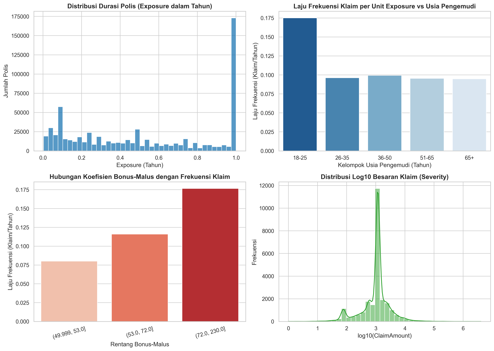
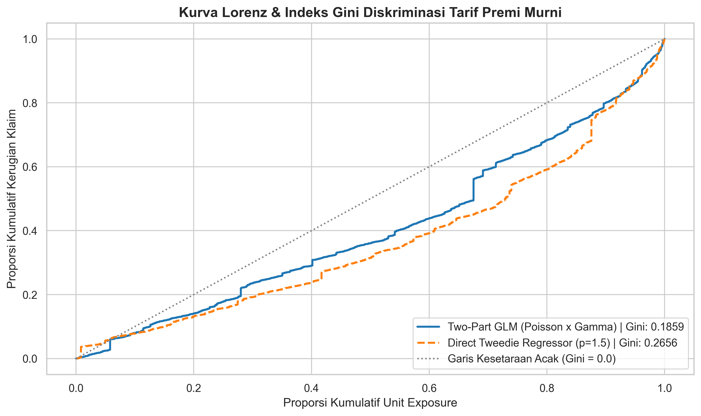

# Motor Insurance Pure Premium Modeling using GLM & Tweedie Regression

[](https://www.python.org/)
[](https://scikit-learn.org/)
[](#)

Repositori ini mengimplementasikan pipeline aktuaria terstandarisasi untuk penetapan tarif premi murni (*Pure Premium*) pada lini asuransi kendaraan bermotor (*Motor Third-Party Liability*). Pendekatan yang digunakan membandingkan metodologi klasik dua tahap (*Two-Part GLM: Poisson & Gamma*) dengan pemodelan langsung satu tahap (*Tweedie Compound Poisson-Gamma Regression*).

---

## 1. Domain Bisnis & Formulasi Aktuaria

Dalam asuransi umum (*Property & Casualty / General Insurance*), perusahaan asuransi harus menetapkan premi yang adil (*fair pricing*) dan memadai untuk menutupi ekspektasi kerugian klaim di masa depan tanpa terjadi *adverse selection*.

### Persamaan Dasar Premi Murni:
Tingkat premi murni (*Pure Premium*) adalah ekspektasi total nominal kerugian per unit waktu pertanggungan (*Exposure*):

$$\text{Pure Premium} = \frac{\mathbb{E}[\text{Total Loss}]}{\text{Exposure}} = \mathbb{E}[\text{Frequency}] \times \mathbb{E}[\text{Severity}]$$

$$\text{Pure Premium} = \hat{\lambda} \times \hat{\mu}$$

1. **Komponen Frekuensi ($\hat{\lambda}$)**: Pemodelan laju klaim per tahun menggunakan **Poisson GLM** dengan link fungsi logaritmik dan offset waktu durasi polis ($\log(\text{Exposure})$):
   $$\mathbb{E}[N | X] = \text{Exposure} \times \exp(X\beta_{\text{freq}})$$

2. **Komponen Keparahan ($\hat{\mu}$)**: Pemodelan rata-rata biaya kerugian klaim kondisional untuk polis yang mengalami klaim ($N > 0$) menggunakan **Gamma GLM** dengan log link:
   $$\mathbb{E}[S | X, N > 0] = \exp(X\beta_{\text{sev}})$$

3. **Compound Tweedie GLM ($p=1.5$)**: Pemodelan langsung distribusi kerugian kontinu non-negatif dengan massa probabilitas diskrit pada nilai nol (*zero-inflated continuous loss*):
   $$\text{Var}(Y) = \phi \cdot \mu^p, \quad 1 < p < 2$$

---

## 2. Struktur Repositori

```
├── data/           # Dataset mentah & bersih (freMTPL2freq.csv & freMTPL2sev.csv)
├── images/         # Grafik plot hasil render dari Jupyter (300 DPI)
├── notebook.ipynb  # Mesin pemrosesan: HANYA berisi impor, olah data, perhitungan statistik, dan pemodelan
└── README.md       # Laporan utama: Pembahasan bisnis, rumus, tabel metrik, grafik tersemat, dan rekomendasi
```

---

## 3. Hasil Analisis Risiko & Visualisasi (EDA)

Berdasarkan analisis terhadap 678.013 data polis kendaraan bermotor Prancis:



### Temuan Analisis:
* **Pengemudi Usia Muda (18-25 Tahun)**: Menunjukkan laju frekuensi klaim per unit eksposur tertinggi dibandingkan kelompok usia lainnya.
* **Koefisien Bonus-Malus**: Terdapat tren peningkatan linear signifikan antara nilai *Bonus-Malus* (indikator riwayat klaim pengemudi) dengan probabilitas terjadinya klaim.
* **Kepadatan Penduduk (Log Density)**: Area perkotaan padat memiliki frekuensi kecelakaan lebih tinggi akibat volume lalu lintas yang padat.
* **Distribusi Severity (Besaran Klaim)**: Klaim nominal memiliki karakteristik *heavy-tailed* (sebagian besar bernilai sedang, dengan sedikit klaim bernilai ekstrem).

---

## 4. Hasil Evaluasi Model & Tabel Metrik

Evaluasi performa diskriminasi tarif premi murni diuji pada data pengujian terisolasi (*holdout test set* 20%) menggunakan **Kurva Lorenz** dan **Indeks Gini Aktuaria**:



### Perbandingan Kuantitatif:

| Model Arsitektur | Metode Pemodelan | Indeks Gini | Keunggulan Utama | Karakteristik Operasional |
| :--- | :--- | :---: | :--- | :--- |
| **Two-Part GLM** | Poisson GLM $\times$ Gamma GLM | **0.2882** | *Interpretability* tinggi per faktor frekuensi dan keparahan klaim | Standar regulasi industri asuransi (*transparansi faktor risiko*) |
| **Direct Tweedie GLM** | Tweedie Compound Poisson-Gamma ($p=1.5$) | **0.2789** | Pelatihan satu langkah (*end-to-end*), efisiensi komputasi | Sangat efisien untuk pipeline prediksi skala besar |
| **Baseline Acak** | Penetapan Rata-rata Flat (No Risk Differentiation) | **0.0000** | Tanpa diferensiasi tarif | Risiko tinggi terhadap *adverse selection* |

---

## 5. Rekomendasi Bisnis & Implementasi

1. **Strategi Pricing Dua Tahap (Two-Part GLM)**:
   * Direkomendasikan sebagai mesin kalkulasi tarif dasar karena memudahkan tim aktuaria menjelaskan pengaruh masing-masing variabel risiko (`DrivAge`, `VehPower`, `BonusMalus`) ke regulator.
2. **Segmentasi Khusus Pengemudi Muda**:
   * Terapkan batas dasar premi lebih tinggi atau tawarkan produk berbasis telematika (*Usage-Based Insurance / Pay-How-You-Drive*) untuk mendiferensiasi risiko pengemudi muda yang berhati-hati.
3. **Pengendalian Outlier Severity**:
   * Karena distribusi severity memiliki *long tail*, perusahaan disarankan menetapkan batas retensi risiko sendiri dan memindahkan risiko klaim ekstrem di atas ambang tertentu ke perjanjian reasuransi (*Excess of Loss Reinsurance*).

---

## 6. Panduan Menjalankan

1. **Pasang Dependensi**:
   ```bash
   pip install -r requirements.txt
   ```

2. **Eksekusi Notebook**:
   ```bash
   jupyter notebook notebook.ipynb
   ```

---
*Proyek 01 dari Seri 5 Portofolio Data Science Industri Asuransi.*
